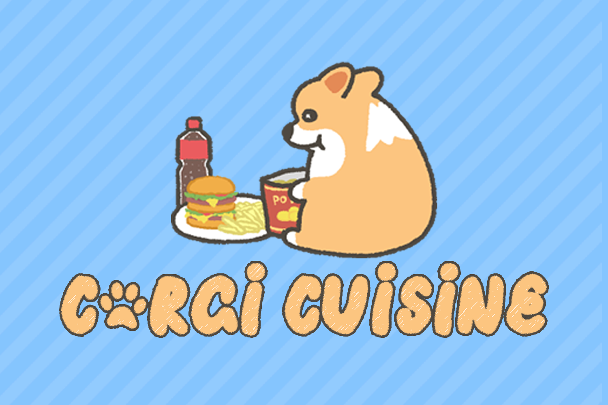
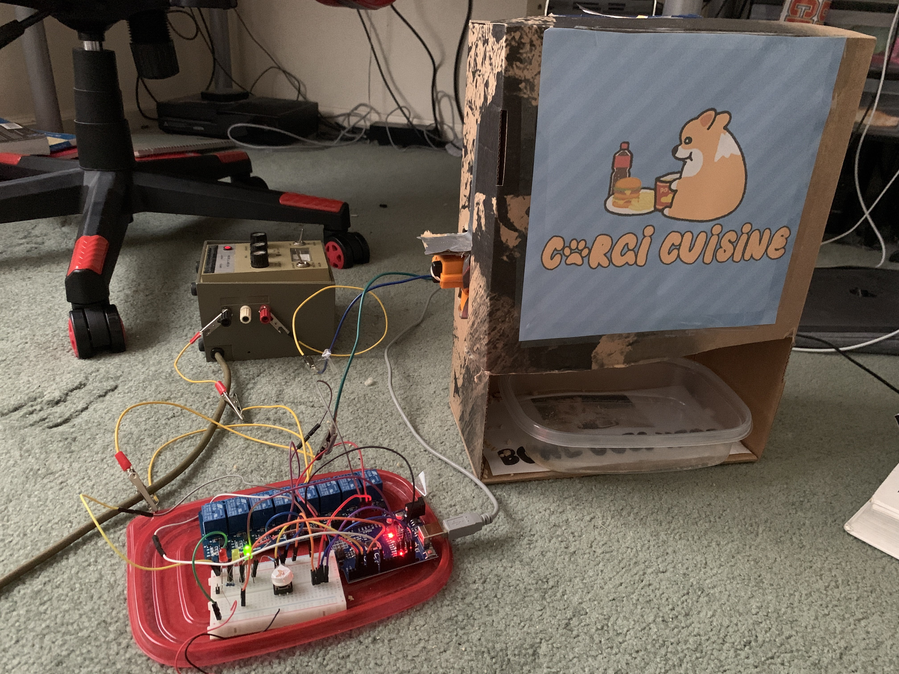
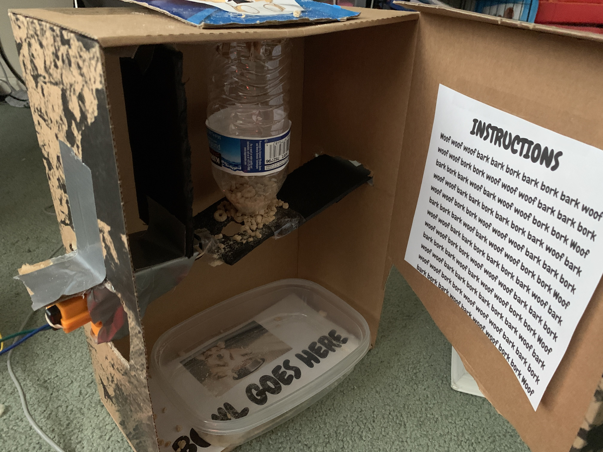
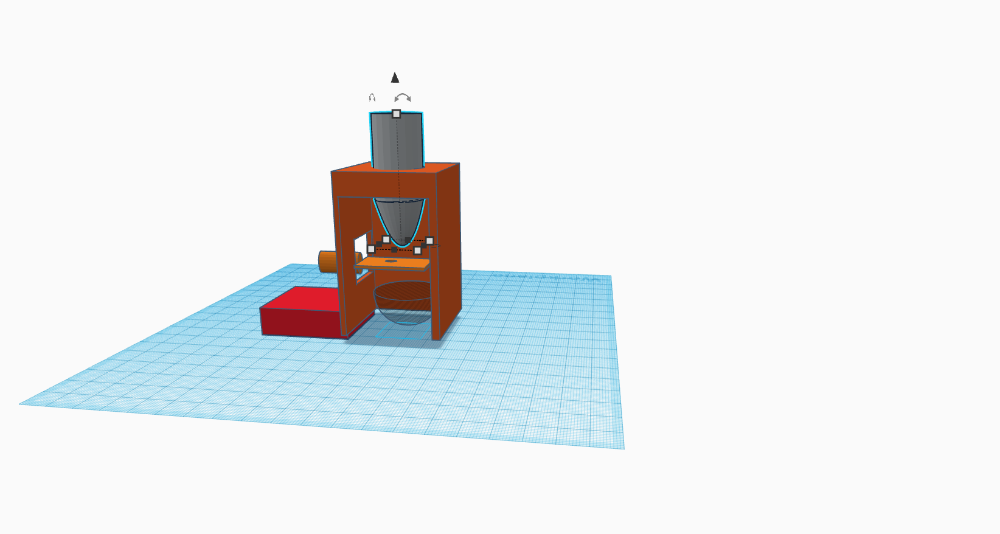

# CorgiCuisine
*woof/10 -chef corgi*

**MLH CorgiHacks Project**

- A Corgi-themed Arduino automatic smart pet feeder

## Authors
- Aaron Fan @fanman1
- Sanjit Ravichandran @sanjitrav 
- Roland Yang @whyroland

## What it Uses
- Languages: C++
- Software: TinkerCAD, Arduino IDE
- Materials: Arduino UNO, Breadboard, 8 Module Relay, Cardboard, Jumpers, 3 LED Lights, 1 Push Button, Resistors, Power Supply, Alligator Clips, Mini-Linear Actuator, Piezoelectronic Buzzer, Rubber Bands, Duct Tape, Tape, Hot Glue, Water Bottle

## Awards at CorgiHacks
- 1st Overall
- Best Use of Hardware